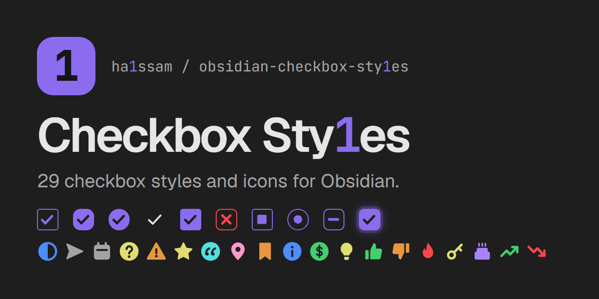

# Checkbox Sty1es

Pick a visual style for each task checkbox in Obsidian. Clicking an unchecked task opens a menu with 29 styles: ten checkbox shapes and 19 colored icons. Each style changes how the checkbox looks and can apply a matching effect to the task text.

## Checkbox shapes

| Style | Text effect | Written to the note |
|---|---|---|
| Classic | strikethrough | `- [c]` |
| Rounded | muted | `- [r]` |
| Circle | accent color | `- [o]` |
| Minimal | faint | `- [m]` |
| Filled | bold | `- [f]` |
| Cross | red strikethrough (cancelled) | `- [-]` |
| Square | underline | `- [s]` |
| Dot | italic (in progress) | `- [.]` |
| Dash | dashed underline (postponed) | `- [~]` |
| Glow | glowing text | `- [g]` |

## Icons

Icon styles replace the checkbox with a colored icon. Most leave the text as it is.

| Style | Text effect | Written to the note |
|---|---|---|
| In progress | none | `- [/]` |
| Forwarded | muted | `- [>]` |
| Scheduled | muted | `- [<]` |
| Question | none | `- [?]` |
| Important | bold | `- [!]` |
| Star | none | `- [*]` |
| Quote | italic | `- ["]` |
| Location | none | `- [l]` |
| Bookmark | none | `- [b]` |
| Info | none | `- [i]` |
| Savings | none | `- [S]` |
| Idea | none | `- [I]` |
| Pro | none | `- [p]` |
| Con | none | `- [C]` |
| Fire | none | `- [F]` |
| Key | none | `- [k]` |
| Win | none | `- [w]` |
| Up | none | `- [u]` |
| Down | none | `- [d]` |

## How it works

- The chosen style is stored as the character between the brackets, so tasks stay plain Markdown tasks. Nothing else in the note is changed.
- One mouse button opens the style menu and the other checks and unchecks the task. You choose which is which in the settings.
- Checking a task with the other button writes a plain `[x]`, shown in the default style chosen in the settings. Unchecked tasks use that style too.
- Colors come from the current theme's variables, so the styles follow light and dark themes.

## Settings

- **Menu button** — left click or right click opens the style menu; the other button checks and unchecks the task.
- **Default style** — the style applied when you check a task with the other button, and the look of unchecked and `[x]` tasks.

## Limitations

- Plugins that only treat `[x]` as done (for example Tasks or Dataview queries) may not count styled tasks as completed.
- Themes that ship their own alternate checkbox icons may override some styles.
- Checkboxes inside embeds, canvas cards and callouts keep the native click behavior.

## Development

```bash
npm install
npm run build
```

`styles.css` is generated from `src/styles.base.css` and the style registry in `src/checkbox-styles.ts`. To add a style, add one entry to `BOX_STYLES` or `ICON_STYLES` with a unique `char`.
